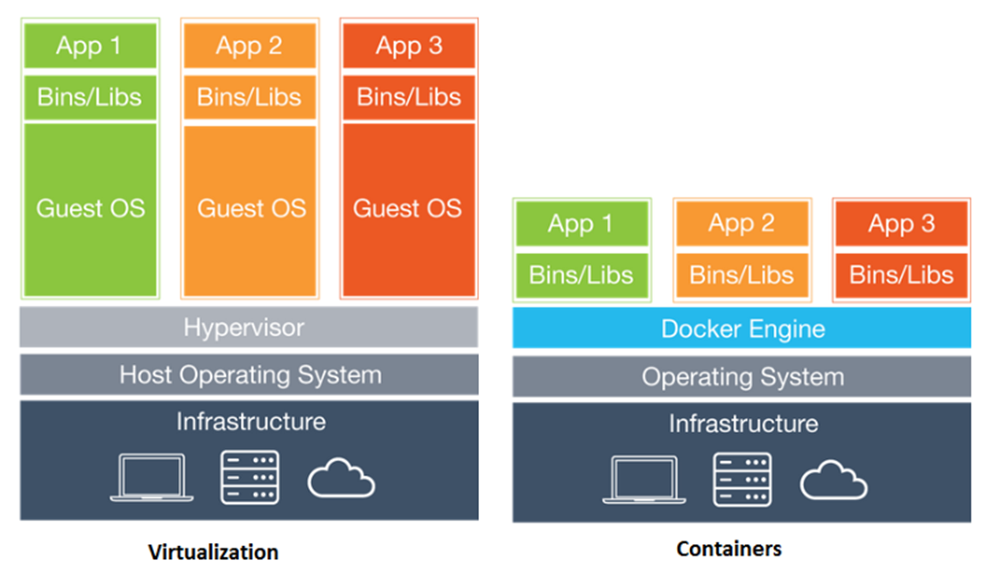
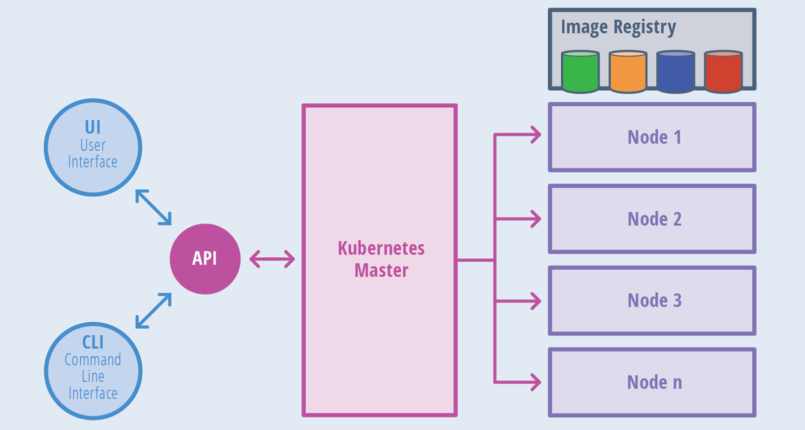
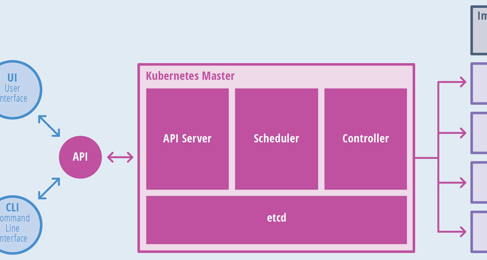
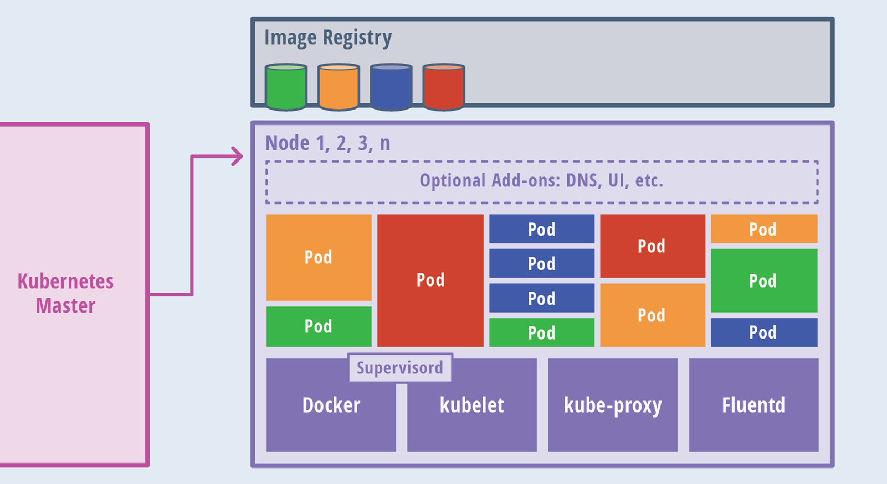

# Docker

- Docker é um projeto que automatiza a implantação de aplicativos dentro de contêineres
- A idéia do Docker é que cada contêiner rode apenas uma aplicação ou serviço e que seus dados importantes fiquem persistidos fora do container
- O contêiner deve ser descartável
-  contêineres virtualizam o sistema operacional e as máquinas virtuais virtualizam um hardware

## Por quê usar?

- Implementação rápida de aplicativos
- Portabilidade entre máquinas
- Controle de versão e reutilização de componentes
- Imagens otimizadas
- Compartilhamento
- Manutenção simplificada

# Rancher

- O Rancher contém um conjunto de softwares necessários para o gerenciamento e orquestração de containers via web
- Ele aceita tanto hosts Linux de nuvem pública, nuvem privada, servidores físicos ou máquinas virtuais
- Os serviços de infraestrutura do Rancher incluem rede, armazenamento, volumes, balanceador de carga, DNS.

## Outros produtos

- Kubernetes para Edge e IoT - https://k3s.io 
- Sistema Operacional Rancher - https://rancher.com/rancher-os/ 
- Sistema de volume para containers - https://github.com/longhorn/longhorn

# Kubernetes

- Kuberentes é uma plataforma de gerenciamento de containers de nível enterprise, sendo multi-cloud: nuvem pública, nuvem privada ou híbrida.
- O Kuberentes provê uma arquitetura flexível, e com mecanismo desacoplado de service discovery. 
- Um cluster consiste pelo menos um master e múltiplos nodes de computação.

## Kubebernetes Master

- O master é responsável pela  API, agendamento dos deployments e gerenciamento total do cluster.

## Nós

- Os nós, são os trabalhadores do Cluster. Eles expõem os serviços de computação, rede e armazenamento para as aplicações. 
- Cada nó do cluster roda:
    - Container runtime, com os agentes para se comunicar com o master. (Kubelet, Kube-proxy) 
    - Componentes adicionais para logs, monitoramento, service discovery e add-ons opcionais. 

    
## Componentes

Componentes do Kuberentes para usarmos em nossas aplicações containeirizadas:

- Pods: Containers que trabalham em conjunto.
- Services: Pods que trabalham em conjunto
- Deployments: Provê um única declaração para Pods e ReplicaSets. 
- Labels: Usado para organizar serviços 
- Daemonsets: Rodar sempre um ou mais pods por nó. 
- Secrets: Salvar dados sensitivos como senhas de bancos de dados.
- ConfigMaps: Arquivo de configurações que suas aplicações irão usar.
- Cron Jobs: Executar tarefas temporais, uma vez ou repetidas vezes.