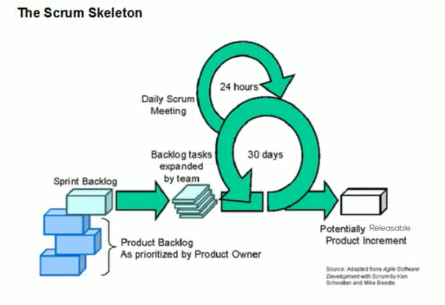

# Introducing Scrum

The founders of Scrum, developed by Ken Schwaber and Jeff Sutherland, "... a framework for developing and sustaining complex products ..."

Basically, scrum consisty in self organizing, cross functional teams.

A project manager does not control them, since their expertise empowers them to make decisions collectively. The team's work in iterations, which allows the business the flexibility to change their requirements, but still gives the development team the certainty it needs to deliver a working piece of the product.

## Name

Scrum takes its name from the analogy to rugby, where a team worked together in the chaotic environment to keep control of a ball. This can be compared to a team working together in a chaotic environment to keep control of a project.

## Scrum theory

It consists of three principles transparency, inspection and adaptation.

1. Being transparent means that functionality is not done until it meets the development team's definition of done. Transparency builds trust between the team members once the team have agreed on transparency, they agree to consistently check up on progress 

2. Inspection and make improvements based on what they have seen.

3. Adaptation, these can be improvements in practices, sticking to values, communication or otherwise.

This is powerful stuff in industry, the ability to consistently inspect and adapt. And that way, they are improving time and time again before, during and after the release of a product.

## The scrum skeleton

- On the left side of the skeleton, we see the product backlog, which is nothing more than a list of all the features and their acceptance criteria that the business desires for the product.
- A subset of that backlog called the sprint backlog is taken on by the team, broken down into tasks and worked on in an iteration called a sprint.
- A sprint is a period of time, less than 30 days. Actually, it's less than a calendar month. And in that time, the team work on the task until they develop a working increment of the product.
- There are some requirements gathering and specification update before the spring, then design, implementation and testing.

- Above the large sprint circle, you will see a smaller circle. This represents the fact that every day the team meet to inspect on progress and their plan for the day in a daily scrum meeting.
- At the end of a sprint, the potentially sharp increment of the product is delivered in the scrum God, this is called the releasable increment. The business can review the increment in the Sprint review and then release the new features to the world if they so wish.
- The team then discuss transparently their progress during the sprint in the Sprint retrospective, so they can improve on things that need improvement or retain things that are going well.

- The cycle then begins again and repeats until the product owner has nothing more to add to the product backlog.

The scrum skeleton demonstrates the simplicity and power of scrum as a mini factory churning out releasable features each sprint.