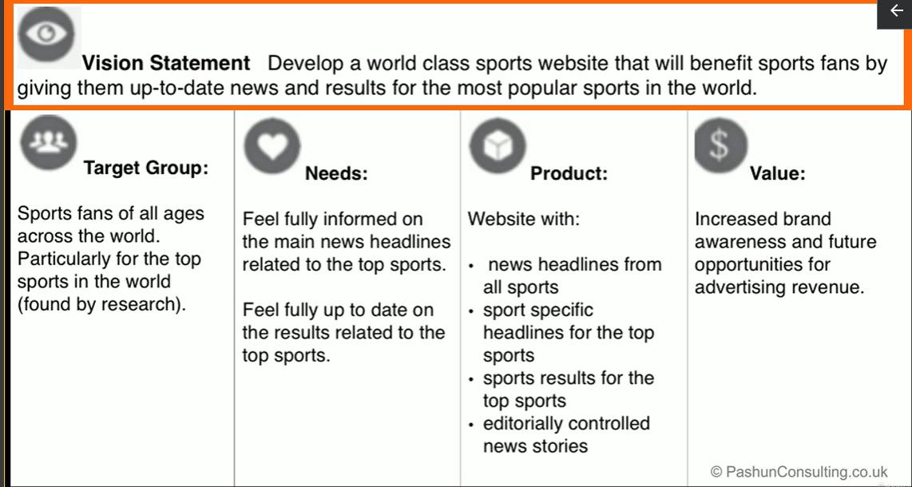

# How to create a product using the scrum framework

- As discussed, product development progresses through a series of sprints, iterations
- sprints or time boxed to between one and four weeks, it entails a number of different events meetings.

Here's a flavor of how you'd be involved with each of these meetings as a product owner

## The really first meeting

- This meeting is a behind the scenes meeting. It's the meeting during which the key stakeholders discuss the requirements for a product with the product owner.

- After a number of meetings like this, the product owner puts all requirements into perspective and aligns them with a vision for the product.
- In reality, there may be a number of these meetings before the vision is finalized.

## Vision statement

To develop a world class sports website that will benefit sports fans by giving them up-to-date news and results for the most popular sports in the world.

- Target Group Sports fans of all ages across the world, particularly for the top sports in the world, found by research.
- Needs feel fully informed on the main news headlines related to the top sports. Feel fully up to date on the results related to the top sports. 
- Product, website with news headlines from all sports. Sport specific headlines for the top sports sports results for the top sports, editorially controlled news stories.
- Value increased brand awareness and future opportunities for advertising revenue. This vision can later be used to form the roadmap.