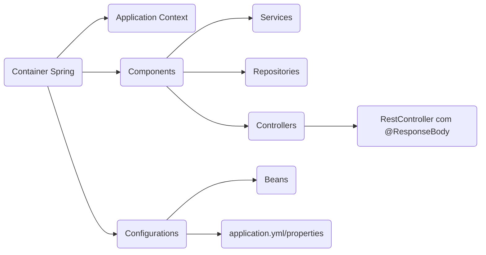

# Arquitetura e Estrutura

A partir da classe inicial, anotado com o @SpringBootApplication, tudo ali pra baixo será mapeado pelo spring.

De acordo com o diagrama acima, podemos ver que o Spring mapeia componentes, sendo os genérios Services, Repositories e Controllers, e as Configurations, sendo os beans configurados e as propriedades necessárias.

## Configuration

A anotação @Configuration é usada para indicar que uma classe declara um ou mais métodos @Bean. Essas classes são fontes de definição de beans. Quando o Spring encontra uma classe anotada com @Configuration, ele trata essa classe como uma fábrica de beans e chama os métodos anotados com @Bean para registrar os beans no contexto do Spring.

## Bean

A anotação @Bean é usada para indicar que um método produz um bean a ser gerenciado pelo contêiner Spring. Cada método anotado com @Bean dentro de uma classe @Configuration retorna um objeto que é registrado como um bean no contexto do Spring. O nome do bean por padrão é o nome do método, mas isso pode ser alterado fornecendo um nome explícito como argumento para a anotação @Bean.

### Qualifier 

Imagine que você tenha várias implementações de uma interface ou várias instâncias de um mesmo tipo de classe definidas como beans. Quando você tenta autowired (injeção automática) um bean desse tipo, o Spring não sabe qual bean usar, resultando em uma exceção de ambiguidade. É aí que @Qualifier entra em cena.

@Qualifier geralmente é usado junto com o nome do bean que você deseja injetar. O nome do bean pode ser o nome padrão gerado pelo Spring, que é o nome do método annotated com @Bean, ou um nome explícito fornecido.

### Bean Primary

Quando o Spring encontra múltiplos beans do mesmo tipo, ele verifica se algum deles está anotado com @Primary. Se houver, esse bean é selecionado automaticamente para injeção, a menos que um @Qualifier seja explicitamente usado para indicar outra escolha.

### Criando anotations

Podemos criar um @interface que nada mais é que uma anotation customizada, agregrando outras anotações e deixando o código mais limpo.

